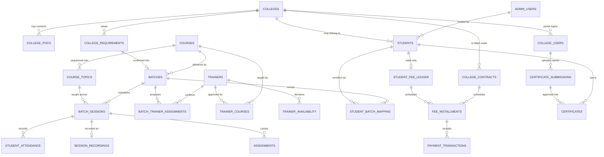

# Gurukulam TMS — System Architecture & Domain Model

What exists today, how the pieces connect, and the contract every future module must honour.

Companion documents: [`admin-portal-plan.md`](admin-portal-plan.md) is *what* gets built;
this is *how it fits together*. [`design-system.md`](design-system.md) governs the UI layer,
[`deployment.md`](deployment.md) the runtime.

---

## 1. Current state — no optimism

Read this before planning anything. The gap between built and specified is large, and pretending
otherwise produces plans that do not survive contact with the repo.

| Layer | State | Where |
| --- | --- | --- |
| Design tokens | **Built** — the only raw values in the codebase | `src/app/globals.css`, `src/design-system/tokens.ts` |
| UI primitives (27) | **Built** | `src/components/ui/` |
| Composed patterns (10) | **Built** | `src/components/patterns/` |
| Console shell, rail, top bar | **Built** | `src/components/layout/` |
| Living style guide | **Built** | `/design-system` route |
| Executive dashboard | **Built on mock data** | `src/features/dashboard/` |
| Country master | **Built** — list, filters, onboarding, drawer edit, archive | `src/features/countries/` |
| City master | **Built** — list, onboarding | `src/features/cities/` |
| Student directory | **Partial** — read-only list, no writes | `src/features/students/` |
| Colleges · Courses · Trainers · Question bank · Settings · Account | **Placeholder routes only** | `ModulePlaceholder` |
| Everything else (18 screens) | **Not started** | — |
| Database | **None.** No Prisma, no Postgres, no migrations | data lives in module-scope arrays inside each service |
| Authentication | **Stub.** `getCurrentUser()` returns a hard-coded object | `src/features/auth/server/get-current-user.ts` |
| Authorisation / scoping | **Not implemented** | — |
| Front-end prototype | **Complete** — 37 routes, all 24 screens, static data | [`prototype/index.html`](prototype/index.html) |

Dependencies actually installed: `next@16`, `react@19`, `class-variance-authority`, `clsx`,
`tailwind-merge`, `server-only`, `tailwindcss@4`. **Not** installed: Prisma, any database driver,
Zustand, React Query, an auth library, a job runner.

The prototype is the design reference for every unbuilt screen. It is static HTML and shares no
code with the app — treat it as a specification you read, never as something you import.

---

## 2. Architecture

### 2.1 The stack decision

Next.js 16 App Router with React Server Components and Server Actions. No separate API process, no
client state library, no data-fetching library. This is a deliberate departure from the source
specification's Next 14 + Express + Zustand + React Query design, recorded with reasons in §4 of the
build plan.

> `AGENTS.md` warns that this Next version carries breaking changes against training data. Read
> `node_modules/next/dist/docs/` before writing routing, caching or server-action code.

### 2.2 The dependency rule

```
tokens → primitives → patterns → features → routes
```

Strictly one-way. A primitive importing from a feature is a bug, not a shortcut. Concretely:

- `components/ui/` knows nothing about colleges, batches or ledgers. It is portable enough to have
  been exported as a standalone design kit.
- `components/patterns/` composes primitives into blocks (`ListPage`, `FilterToolbar`, `StatTile`)
  and is still domain-agnostic.
- `features/<module>/` owns its types, data access and domain components. It may import from
  `ui`, `patterns` and `lib` — never from another feature.
- `app/` contains routing only. No business logic, no data shaping.

**Feature slices, not layer folders.** A module brings its own everything. Nothing shared has to
change to add one, so slices stay independently ownable and independently deletable.

### 2.3 The data seam

`features/*/server/*-service.ts` is the **only** place that knows where data comes from. Today that
is an in-memory array; tomorrow it is Prisma. Components consume typed contracts, so the migration
touches one file per feature and no UI.

This seam is the single most important structural decision in the codebase. Preserve it.

### 2.4 State lives in the URL

Filters, tabs, pagination and search all live in `searchParams`. Views stay server-rendered,
shareable and back-button-correct. Only five components opt into the client: `NavRailLink`, `Tabs`,
`FilterTabs`, `Dialog`, `Drawer`.

Client state is permitted only where it is genuinely local and ephemeral — an open drawer, a
half-typed payment form. It is never the source of truth for anything a URL could carry.

### 2.5 Writes go through Server Actions

`features/*/server/actions.ts`. Validation runs server-side so it cannot be bypassed and so forms
work before hydration. Errors come back keyed by field. `revalidatePath` then `redirect`.

`features/countries/server/actions.ts` is the reference implementation — copy its shape.

---

## 3. Domain model

### 3.1 The core spine



### 3.2 Entities by domain

| Domain | Tables | Notes |
| --- | --- | --- |
| Localisation | `countries`, `cities` | Cities scope sub-admin access |
| Access | `roles`, `admin_users`, `college_users` | Credentials also needed on `students` and `trainers` |
| Colleges (CRM) | `colleges`, `college_pocs`, `college_requirements`, `college_contracts` | A college is an actor, not a directory row |
| Catalog | `courses`, `course_topics`, `trainer_courses` | Course → topic → session is the content hierarchy |
| Delivery | `batches`, `batch_sessions`, `batch_trainer_assignments`, `trainer_availability`, `student_attendance`, `session_recordings` | |
| Enrolment | `students`, `student_batch_mapping` | |
| Money | `student_fee_ledger`, `college_contracts`, `fee_installments`, `payment_transactions` | Two billing parents, one schedule engine |
| Learning | `assignments`, `assignment_submissions` | Batch-level, optionally session-level |
| Assessment | `question_bank` | |
| Outcomes | `certificates`, `certificate_submissions` | A college uploads names; an admin approves before release |
| Placement | `job_postings`, `job_audience_rules` | |

### 3.3 Corrections to the source specification

The DDL in `Gurukulam_TMS_Production_Code_Spec.docx` cannot express the business as it actually
operates. These are not preferences.

1. **`students.college_id` must be nullable.** The spec has `NOT NULL REFERENCES colleges`. A retail
   walk-in has no college and never will, so the spec makes half the business unrepresentable.
2. **`batches.college_id` must exist, nullable.** A college batch is dedicated; a retail batch is open.
3. **`students.enrolment_channel`** (`RETAIL` | `COLLEGE`) plus `created_by_college_id`. Do not infer
   the segment from `college_id IS NULL` — an admin may attach a retail student to a college later,
   and acquisition channel is a reporting dimension in its own right.
4. **Credentials are missing entirely.** `students` has `account_status` but no `password_hash`. Same
   for `trainers`. Nobody can log in to the portals the spec describes.
5. **`fee_installments` needs two parents** — nullable `ledger_id`, nullable `contract_id`, and a
   CHECK that exactly one is set.
6. **`student_attendance` does not exist.** The spec names attendance logs and defines no table.
7. **`discount_amount` is `GENERATED ALWAYS AS ... STORED`.** Prisma cannot manage generated columns —
   declare it read-only in the model and create it in hand-written migration SQL.
8. **Money must not be `number`.** The spec's own fee engine claims strict decimal handling and then
   does float arithmetic. Use integer minor units (paise) or Prisma `Decimal`.
9. **`trainer_courses` does not exist.** The spec carries free-text `skill_tags` only, which cannot
   answer "who is allowed to run this batch?" without a string match. Approving a trainer for a
   course is a relationship, not a tag.
10. **`assignments` hang off a session**, not a batch. A session can carry several, or none.
11. **Every record needs `created_by` / `created_at`.** The spec has `created_at` only. Students in
   particular must record which admin — or which *college user* — onboarded them; it is how
   institutional intake is audited.
12. **New `certificate_submissions`** — a college POC uploads a list of names against a completed
   training; an admin approves or rejects each row; only approved rows become `certificates`.
   Status `SUBMITTED → UNDER_REVIEW → APPROVED / REJECTED → RELEASED`.

---

## 4. Invariants

Rules that must hold no matter what module is added. Each names where it is enforced — enforcement
belongs in the service layer or the schema, never in a form component, because a second caller will
eventually appear.

| # | Invariant | Enforced at |
| --- | --- | --- |
| 1 | A student belongs to at most one college. Retail students belong to none. | Schema — nullable FK |
| 2 | Retail and college rosters never mix. A student may only join a batch whose `college_id` matches their own (both null, or both equal). | Allocation service |
| 3 | Billing level follows segment: retail bills the student, college bills the institution. A student never has both a ledger and a contract seat. | Allocation service |
| 4 | An installment hangs off exactly one parent — a student ledger or a college contract. | Schema CHECK |
| 5 | Money is never a float, at any layer, including display formatting. | `lib/format.ts` + schema |
| 6 | A reminder's recipient resolves from the installment's parent, never from a stored column. A college's students never receive an invoice reminder. | Reminder service |
| 7 | Certificate *eligibility* is identical across segments; certificate *access* is not — retail students download their own, colleges download their students'. | Certificate access rule |
| 8 | Trainer free/busy is computed from committed sessions plus declared leave. Never stored. | Availability service |
| 9 | A trainer assignment is not committed delivery until the trainer confirms. | Assignment state machine |
| 10 | Job audience is evaluated at read time. Never materialised per student. | Job visibility service |
| 11 | Every scope (city for sub-admins, college for college users) is applied inside the service, never by the caller. | Every service function |
| 12 | Allocation is one transaction: mapping, session access, ledger, credentials. All of it, or none. | Allocation service |
| 13 | Overpayment is refused at write time, not corrected afterwards. | Payment service |
| 14 | A confirmed requirement keeps a link to the batch it produced. | Schema FK |
| 15 | A batch's trainer must be approved for that batch's course. | Batch service, against `trainer_courses` |
| 16 | An assignment belongs to a batch; its session link is optional. | Schema — nullable `session_id` |
| 17 | A session must be marked complete before assignments can be set against it. | Session service |
| 18 | Certificates reach a college only through an approved submission. An uploaded name is not a certificate. | Certificate service |
| 19 | An operator cannot edit their own role, scope or identity. Those are Super-Admin fields. | Account route — read-only by design |

---

## 5. State machines

| Entity | States | Notes |
| --- | --- | --- |
| `college_requirements` | `NEW → UNDER_REVIEW → CONFIRMED → FULFILLED`, `REJECTED` terminal | Confirmation creates the batch |
| `batch_trainer_assignments` | `PROPOSED → CONFIRMED` / `DECLINED` | Decline returns the batch to unassigned, reason retained |
| `batches` | `SCHEDULED → IN_PROGRESS → COMPLETED`, `CANCELLED` | |
| `batch_sessions` | `SCHEDULED → LIVE → COMPLETED`, `CANCELLED` | Reschedule keeps identity, emits a notification |
| `fee_installments` | `PENDING → PARTIALLY_PAID → PAID`; `PENDING → OVERDUE` past due | Nightly cron drives the overdue transition |
| `student_fee_ledger` | `UNPAID → PARTIALLY_PAID → PAID_FULL`; `OVERDUE` when any installment is | Derived, never set directly |
| `college_contracts` | `DRAFT → ACTIVE → PAID`, `CANCELLED` | |
| `assignments` | `DRAFT → OPEN → CLOSED` | |
| `certificates` | `DRAFT → ISSUED → REVOKED` | Revocation takes effect on the public verifier immediately |
| `certificate_submissions` | `SUBMITTED → UNDER_REVIEW → APPROVED / REJECTED → RELEASED` | College uploads names; admin decides per row |
| `batch_sessions` completion | `SCHEDULED → COMPLETED` | Gates the assignment tab and prompts for the recording |
| `job_postings` | `DRAFT → PUBLISHED → CLOSED → ARCHIVED` | Only `PUBLISHED` is visible to students |
| Portal access | `NONE → INVITED → GRANTED → REVOKED` | Grant sends the credential email |

---

## 6. Transactional flows

These are the connections. Each is one unit of work.

### 6.1 Retail enrolment

1. Student record created (no college, `enrolment_channel = RETAIL`).
2. Admin selects course, then a batch **with `college_id IS NULL`** (invariant 2).
3. Pitched price agreed against the course's `standard_market_value`; `discount_amount` is generated.
4. Advance recorded with mode, transaction ID and date.
5. Installment schedule authored by hand — count, amount and due date per row. One to a hundred.
6. **In one transaction:** write `student_batch_mapping`, grant access to every session in the batch
   (past and future), create `student_fee_ledger` + `fee_installments`, issue credentials.
7. Welcome pack emailed: credentials, schedule, payment plan.

#### The chain, stated once

`Course → Topic → Batch → Session → (Attendance · Assignment · Recording)`

A **course** holds topics. A **batch** runs that course for a cohort. **Sessions** are scheduled
under the batch, each against a topic — a topic may need one session or several. Attendance,
assignments and the recording all hang off the **session**, not the batch, because the session is
the unit that actually happens on a given day.

Retail, step by step:

1. **Create the course** with its topics.
2. **Approve trainers for it** (`trainer_courses`). This filters the trainer picker later — a batch
   cannot be assigned a trainer who is not approved for its course (invariant 15).
3. **Create the batch**, then **add students** to it.
4. **Schedule the sessions** under the batch, one or more per topic.
5. **Students are emailed on enrolment** — schedule, trainer, venue, and their credentials.
6. **Attendance is marked** per session, by the trainer or by an admin.
7. **The session is marked complete.** This is a deliberate act, not a date passing — it releases
   assignments and prompts for the recording (invariant 17).
8. **Assignments** are set against the sessions that need them. Most do not.
9. **The recording is linked** as a YouTube URL once the session is delivered.

### 6.2 College engagement

1. Requirement logged (by an admin today; by a college user once that portal exists).
2. Admin confirms it → creates a batch with `college_id` set, linked back to the requirement.
3. Admin proposes a trainer **from the availability calendar**, filtered by the course's skill tags.
4. Trainer confirms → assignment becomes committed delivery; `batches.primary_trainer_id` is set.
5. Sessions generated under the batch, per topic.
6. College adds its students; each joins that batch only, with **no individual ledger**.
7. `college_contracts` carries the money. Invoices and reminders go to the college.
8. On completion, certificates issue per student — downloaded by the college, not the student.

### 6.3 Recording a payment

1. Select installment; amount validated against its remaining due (invariant 13).
2. Capture date, mode (`UPI` | `CREDIT_CARD` | `DEBIT_CARD` | `CASH` | `OTHER`) and **transaction ID —
   required for every mode except cash**.
3. **In one transaction:** write `payment_transactions`, update the installment, recompute
   `total_paid` and `balance_pending` on the parent, re-derive parent status.
4. Email a PDF receipt to the student's registered address; optional WhatsApp confirmation.

### 6.4 Rescheduling a session

1. New date, time and room/link captured with a reason.
2. Session updated in place — identity preserved, so attendance and recordings stay attached.
3. **Notification fan-out from the same write:** every student on the roster, the assigned trainer,
   and — for a college batch — the institution.

### 6.5 Nightly reminder cron

Runs 00:01. A route handler behind a shared secret, driven by an external scheduler — **not**
`node-cron`, which does not survive serverless.

1. Installments due in three days → reminder to the parent's recipient (invariant 6); set
   `reminder_sent_flag`.
2. Installments past due and still `PENDING` → `OVERDUE`, dispatch notice.
3. Re-derive parent ledger/contract status.

---

## 7. Identity and scope

```ts
interface Principal {
  id: string;
  name: string;
  roleId: string;
  roleName: string;
  cityScope: string[] | null;      // null = global
  collegeScope: string | null;     // set for college portal users
  permissions: Record<string, { read: boolean; edit: boolean; delete: boolean }>;
}
```

Every service function takes the principal and applies scope itself (invariant 11). A regional
sub-admin restricted to Bengaluru gets that filter appended to every query, including the
dashboard's cached figures — so cache keys must be scope-derived, or one region's numbers leak into
another's.

A **college user is the same mechanism** with a college scope instead of a city one. Modelling it
this way now avoids a parallel permission system when the college portal is built.

Widen `getCurrentUser()` to this shape **before** building further modules. Retrofitting scope
across a dozen query functions is the expensive version of this work.

---

## 8. Conventions

**Tables** — plural, snake_case. Join tables read `<a>_<b>_mapping`. Primary keys are
`<singular>_id`, `VARCHAR(36)` UUID.

**Business IDs** are human-facing and distinct from primary keys. They are **generated on save and
never typed** — a form shows the value it will get, disabled. Two reasons: an operator-typed code
collides, and the ID is the record's identity, so every session, ledger, certificate and report
points at it. Editing one after creation breaks those references silently.

| Prefix | Entity | Example |
| --- | --- | --- |
| `CTRY-` / `CITY-` | Country / city | `CITY-BLR` |
| `CLG-` | College | `CLG-SNC-01` |
| `REQ-` | Requirement | `REQ-2026-014` |
| `CON-` | Contract | `CON-2026-007` |
| `CRS-` | Course | `CRS-DA-2026` |
| `BTC-` | Batch | `BTC-DA-SEP-A` |
| `TRN-` | Trainer | `TRN-0042` |
| `STU-` | Student | `STU-2026-0891` |
| `ASG-` | Assignment | `ASG-0142` |
| `TXN-` | Payment transaction | `TXN-00981` |
| `GK-CERT-` | Certificate | `GK-CERT-2026-00418` |

Derivation rules: `CLG-` from the college name and city plus a running number; `BTC-` from the course,
start month and cohort letter; `STU-` and `TXN-` are year plus sequence. All are immutable once issued.

**Routes** are plural and lowercase; detail pages nest (`/colleges/[id]`), sub-views nest again
(`/colleges/[id]/students`). Cross-module list views live under their owning module.

**Feature folder shape:**

```
features/<module>/
├── types.ts                 domain types + query/page/summary contracts
├── server/
│   ├── <module>-service.ts  the ONLY thing that touches data
│   └── actions.ts           server actions — validation lives here
└── components/              domain components (tables, forms, drawers)
```

---

## 9. Adding a module

The checklist. `features/countries/` is the worked example for a master-data module;
`features/dashboard/` for a read-only aggregate.

1. **Types first.** `types.ts` — the entity, plus `<X>Query`, `<X>Page`, `<X>Summary`.
2. **Service.** `server/<x>-service.ts`, `import "server-only"` at the top. Takes the principal,
   applies scope, returns typed contracts. Filtering and pagination happen here, not in the page.
3. **Actions.** `server/actions.ts` for writes. Validate server-side, return field-keyed errors,
   `revalidatePath`, then `redirect`.
4. **Columns.** A `Column<TRow>[]` descriptor — `DataTable` is generic, so tables are data.
5. **Route.** `app/(console)/<module>/page.tsx`. Routing only.
6. **Navigation.** One entry in `config/navigation.ts`; add a `TABS` group if the module has
   sub-views. The rail, active state, tooltips and accessible labels all follow.
7. **Check the invariants in §4.** If the module touches enrolment, money, scheduling or visibility,
   at least one applies to it.

**Do not:**

- reach into another feature's service — expose a contract or duplicate the read
- put business logic in a route file or a component
- add a client component to get a filter working — use `searchParams`
- add a raw hex, px size or one-off shadow — see `design-system.md` §2
- add a token to `globals.css` without also registering it in `lib/cn.ts` — it will silently
  vanish from the DOM the moment it meets another utility of the same prefix

### The nav rail

Eleven primary entries, ordered to read as the delivery chain rather than alphabetically:

```
Dashboard · Colleges · Students · Courses · Batches
Trainers · Fee Ledger · Content · Hiring
--
Settings (General | Roles | Administrators | Countries | Cities) · Account
```

**Nine primary entries** — the rail carries the top of each chain only. Sessions live under Batches
and assignments under a session, because `Course > Batch > Session > Assignment` is a containment
hierarchy, not four peer modules. Promoting a child to the rail breaks the mental model and costs a
slot. Other grouping decisions: Localisation under Settings (set-up-once configuration); RBAC and
administrators under Settings; certificates under Students; recordings and question bank under
Content.

### CRUD surface

Every list carries its verbs on the row rather than behind a hidden menu, so what an operator can do
to a record is visible without hovering:

| Module | Operations |
| --- | --- |
| Students | View all · Add · Open record · Suspend · Delete |
| Courses | View all · Add · Modify · Delete |
| Batches | View all · Add · Modify · Delete |
| Sessions (under Batches) | View all · Add · Modify · Delete · Mark complete |
| Assignments (under Sessions) | Add · Modify · Delete |
| Trainers | View all · Add · Modify · Delete |
| Colleges | View all · Add · Open record · Modify · Delete |
| Hiring | View all · Add · Modify · Remove |
| Fee Ledger | Read + record payment only — no delete. A receipt is a financial record |

---

## 10. Integrations

| Service | Used for | Status |
| --- | --- | --- |
| PostgreSQL 15 + Prisma | All persistence | **Planned.** Nothing installed |
| Redis | Login lockout (5 failures / 15 min → 30 min) | Planned, that use only |
| YouTube | Session recordings | Planned — see caveat below |
| AWS S3 + CloudFront | Certificates, syllabi, self-hosted video | Planned |
| Zoom | Live class links, recording webhooks | Planned |
| WhatsApp Business API | Fee reminders, receipts, schedule changes | Planned |
| Email (transactional) | Credentials, receipts, invitations, notifications | Planned |
| External scheduler | Nightly reminder cron | Planned |
| Payment gateway | — | **Not used.** Payments are collected offline and recorded |
| Naukri | Job feed | Deferred to a later stage |

### The YouTube caveat

Embed parameters (`rel=0`, `iv_load_policy=3`, `youtube-nocookie.com`) remove related videos,
annotations and branding. **They cannot suppress advertising** — YouTube serves that server-side and
no player parameter turns it off. For a genuinely clean player: upload unlisted to an unmonetised
channel, or self-host on S3/CloudFront with signed URLs as the original architecture proposed. Record
whichever choice is made here, because the student portal will inherit it.

---

## 11. Deferred by design

Not omissions. Each is a decision with a known re-entry point.

| Deferred | Re-entry point |
| --- | --- |
| Attendance | Deferred by request. `student_attendance` stays in the schema so sessions do not need reshaping when it lands; admin and trainer will write the same row |
| Trainer portal | `batch_trainer_assignments` already exists; the trainer portal writes the same rows |
| Student portal | Credentials issued at allocation; session access already granted |
| College portal | `college_users` + `collegeScope` on the principal; admin performs every college action today |
| Naukri feed | `job_postings.source` / `external_ref` / `external_url` already carried |
| Application tracking | Would need an applications table and a student-side action — in scope explicitly or not at all |
| Payment gateway | Ledger records offline receipts; a gateway would write the same transaction rows |

**The admin portal stands in for all three portals.** Every action they will perform — marking
attendance, confirming an assignment, raising a requirement, adding students, downloading
certificates — is performable by an admin now, and permanently. Operations teams need the override
regardless of which portals ship.
